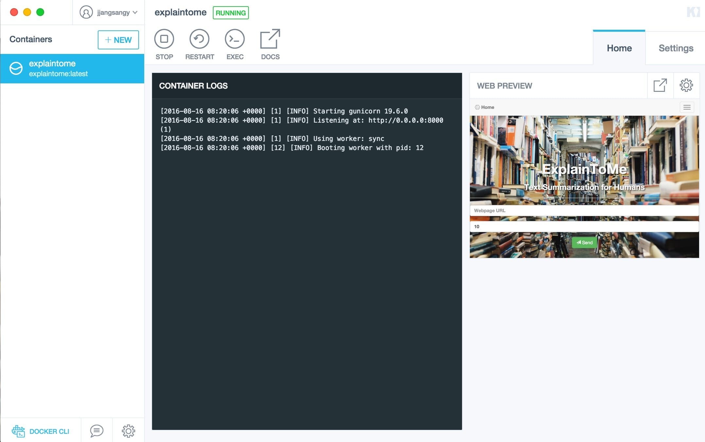

# ExplainToMe

[](https://travis-ci.org/jjangsangy/ExplainToMe)
[](https://github.com/jjangsangy/ExplainToMe/blob/master/LICENSE)
[](https://quay.io/repository/jjangsangy/explaintome)

## Automatic Web Article Summarizer


[](https://heroku.com/deploy)

# What is it?

`Explain To Me` is a automatic text summarizer, that utilizes
[TextRank](http://web.eecs.umich.edu/~mihalcea/papers/mihalcea.emnlp04.pdf),
a graph based algorithm to scans through the contents of a website to
extract a concise machine generated summary. The methodology is similar
to the way search engines return the most relevant web pages from a
users search query.

# Support

Here’s a list of Python platforms that are officially supported.

* Python 2.7
* Python 3.4
* Python 3.5
* pypy 2.5.0 -> 2.7.9

# Quickstart

# Install

## Clone Repository

```bash
$ git clone https://github.com/jjangsangy/ExplainToMe.git
```

## Create a virtualenv

```bash
$ virtualenv -p python venv
```

## Source Virtualenv

```bash
$ source venv/bin/activate
```

## Install Python Dependencies

```bash
$ pip install --upgrade pip setuptools wheel
$ pip install -r requirements.txt
```

## Run Server

```bash
$ python manage.py runserver
Running on http://127.0.0.1:5000/ (Press CTRL+C to quit)
```

Now go to your browser and point it towards `http://127.0.0.1:5000`

# Docker

Running ExplainToMe via the [official Docker image](https://hub.docker.com/r/jjangsangy/explaintome/)
is an easy way to start a server if you don't want to install python.

We assume here you have already installed Docker for your system.

If you are getting started on OS X, the [Docker toolbox](https://docs.docker.com/engine/installation/mac/)
is the first thing to checkout.

```bash
$ docker run -it -p 5000:5000 jjangsangy/ExplainToMe:latest
```

Once the server is running, navigate to either localhost:5000 (on Linux) or
hostname:5000 (on Mac OS X), where hostname is the IP addresses
of your virtual machine, obtained using

```bash
$ docker-machine ip my-vm-name
```

Now access your docker machine ip at port `docker-machine-ip:5000`

# Kitematic

You might also want to try [Kitematic](https://kitematic.com/) on OS X which provides a GUI for running Docker images.
Running ExplainToMe through Kitematic is easy, just search for the
`jjangsangy/ExplainToMe` image, start it, and you should see it running




# Things to look forward to:

-   Summaries of documents in other languages than English!
